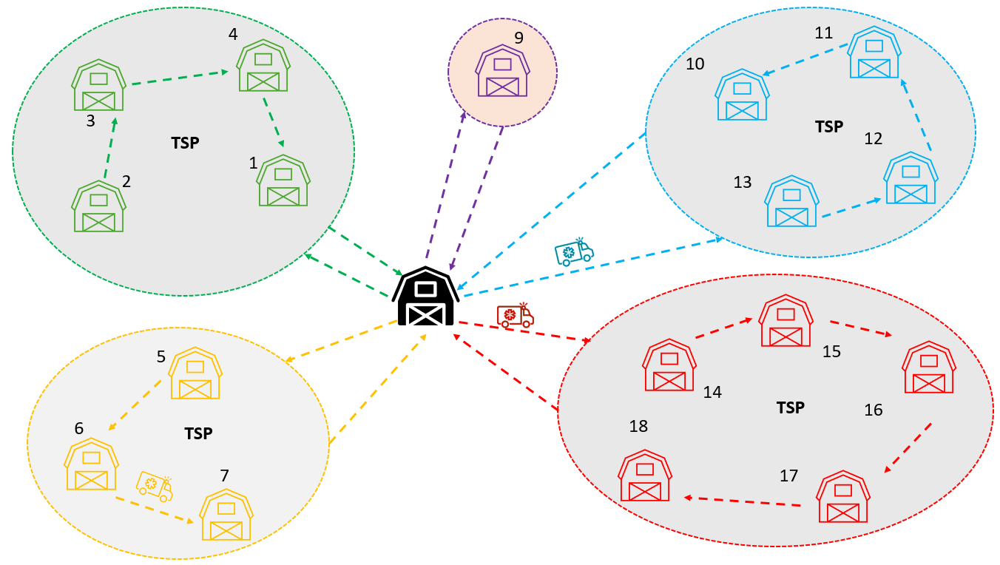
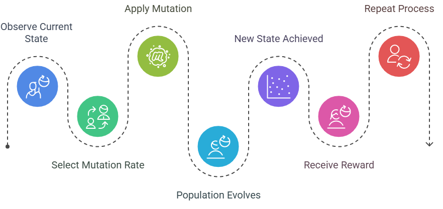
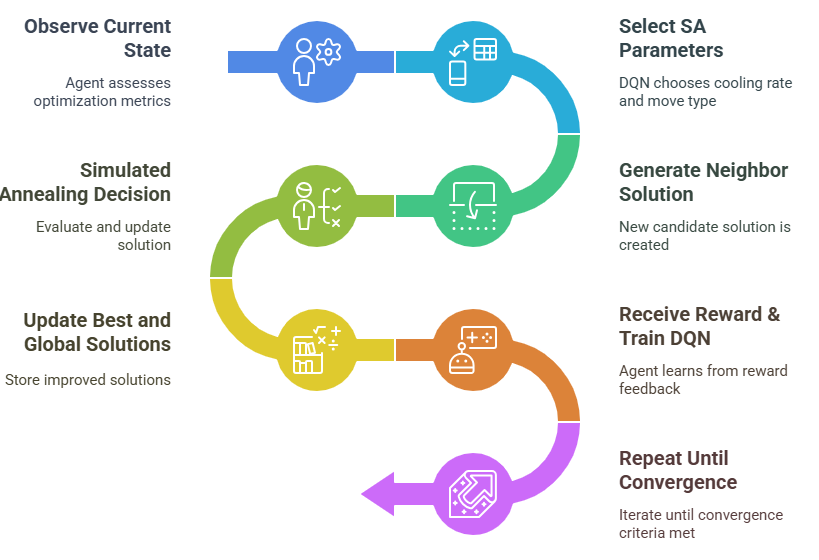
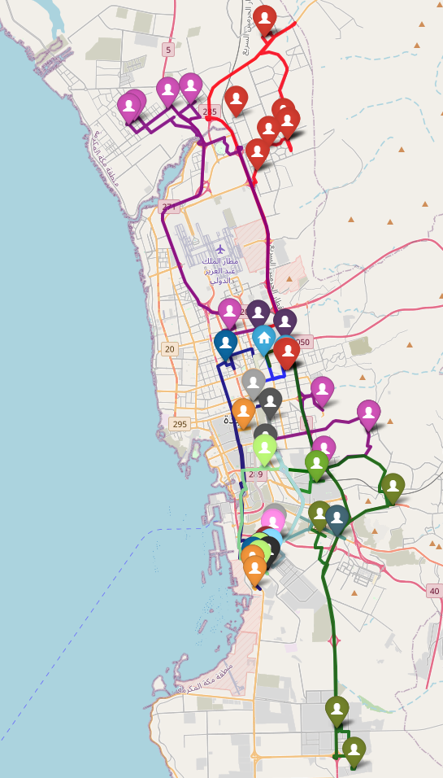

[](https://github.com/ai4smlab/Beverage-Distribution-Logistics/blob/main/LICENSE)


# Hybrid Clustering and Adaptive Metaheuristics for Capacitated Vehicle Routing Problems: A Case Study in Beverage Distribution Logistics

## Authors  
**Rahaf M. Alzahrani**, King Fahd University of Petroleum and Minerals (KFUPM)  
**Zead Saleh**, University of Business and Technology (UBT)  
**Alaa Khamis**, AI for Smart Mobility Lab  at KFUPM


## 🧭 Project Overview

This project addresses the **Capacitated Vehicle Routing Problem (CVRP)** in real-world logistics using an integrated hybrid optimization framework. The proposed system combines **clustering-based spatial decomposition** with **metaheuristic algorithms** and **reinforcement learning**, validated using operational data from a leading beverage distributor in Saudi Arabia.


## 🧠 Methodology Summary

The solution architecture is divided into two main phases:

1. **Clustering Phase**  
   - Customers are grouped using **K-Means** or **C-Means** algorithms.  
   - A capacity-aware reassignment step ensures vehicle feasibility within each cluster.

2. **Routing Optimization Phase**  
   - Each cluster is solved independently using:
     - **Exact methods** (TSP-based MIP with MTZ constraints via CPLEX)
     - **Metaheuristics**: Genetic Algorithm (GA), Simulated Annealing (SA), Ant Colony Optimization (ACO)
     - **Adaptive Metaheuristics**: GA and SA enhanced with **Deep Q-Networks (DQN)** for dynamic parameter control


**Overivew**  


**DQN-GA Procedure**  


**DQN-SA Procedure**  



## 🗺️ Sample Results

The project used real delivery data from 58 customers across Jeddah, including:
- Sales orders
- Product dimensions
- Truck pallet capacities
- Geolocation data

<p>
  
  <br>
  <em>Figure: Final GA-based routing solution visualized on the city map.</em>
</p>


## 📊 Comparative Performance Table

| Algorithm            | Total Distance (km) | Vehicles Used |
|----------------------|---------------------|----------------|
| Genetic Algorithm (GA)       | **865.13**             | 19             |
| Adaptive GA (AGA)            | 916.66                 | 18             |
| Simulated Annealing (SA)     | 1096.39                | 19             |
| Adaptive SA (ASA)            | 1193.34                | 19             |
| Ant Colony Optimization (ACO)| 1078.77                | 18             |
| Two-phase K-Means            | 970.90                 | 20             |
| Two-phase C-Means            | 979.50                 | 20             |


## ⚙️ Data Description

The dataset includes:
- **58 customer locations** (latitude/longitude)
- **Demand data** per location
- **Product types and packaging specifications**
- **Truck fleet capacities** (in pallets)
- **Road distances** derived from OpenStreetMap

All data was preprocessed and normalized to fit a fixed vehicle capacity for CVRP modeling.


## 💻 Code & Reproducibility

[📥 Download `Beverage_Distribution_Logistics.ipynb`](Beverage_Distribution_Logistics.ipynb)

## 🔖 Citation

If you use this framework or datasets, please cite:  

Plain text (IEEE style):

Alzahrani, Rahaf M. and Saleh, Zead and Khamis, Alaa, "Hybrid Clustering and Adaptive Metaheuristics for Capacitated Vehicle Routing Problems: A Case Study in Beverage Distribution Logistics," submitted to 2026 IEEE International Conference on Smart Mobility.

BibTeX:
```
@article{Alzahrani2026,
  title   = {Hybrid Clustering and Adaptive Metaheuristics for Capacitated Vehicle Routing Problems: A Case Study in Beverage Distribution Logistic},
  author  = {Alzahrani, Rahaf M. and Saleh, Zead and Khamis, Alaa},
  journal = {Submitted to  2026 International Conference on Smart Mobility and Logistics Ecosystems (SMiLE)},
  year    = {2026}
}
```
